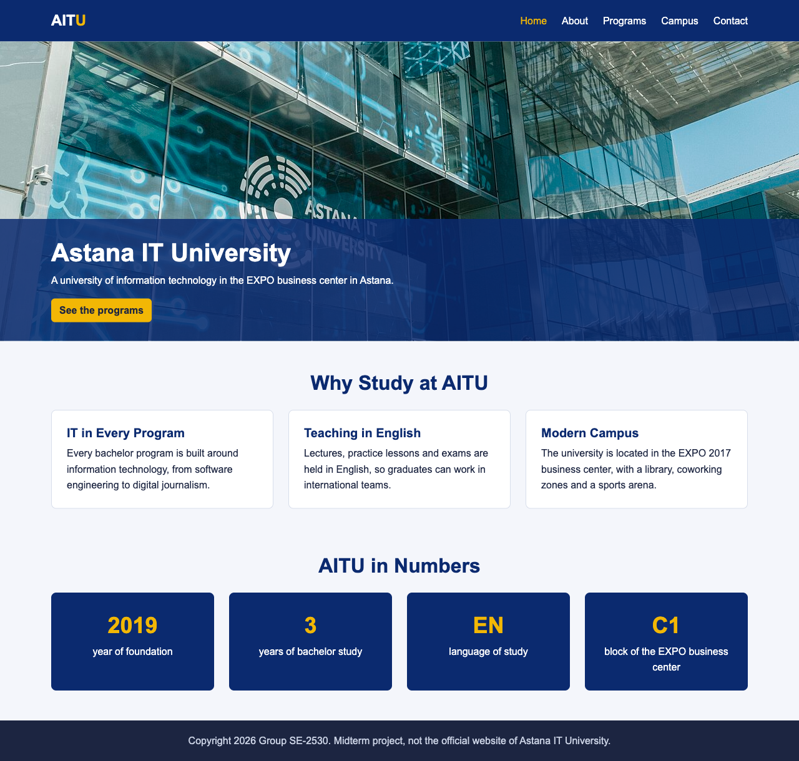
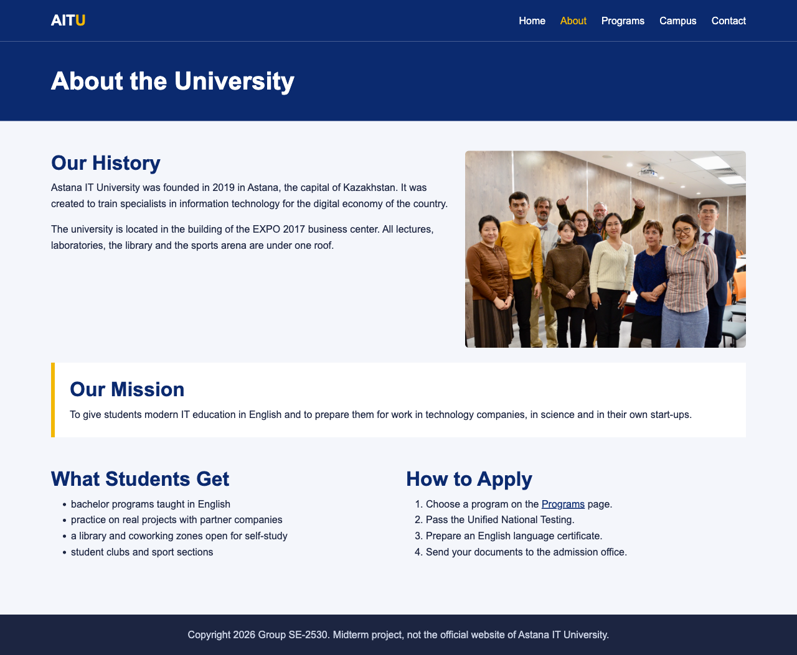
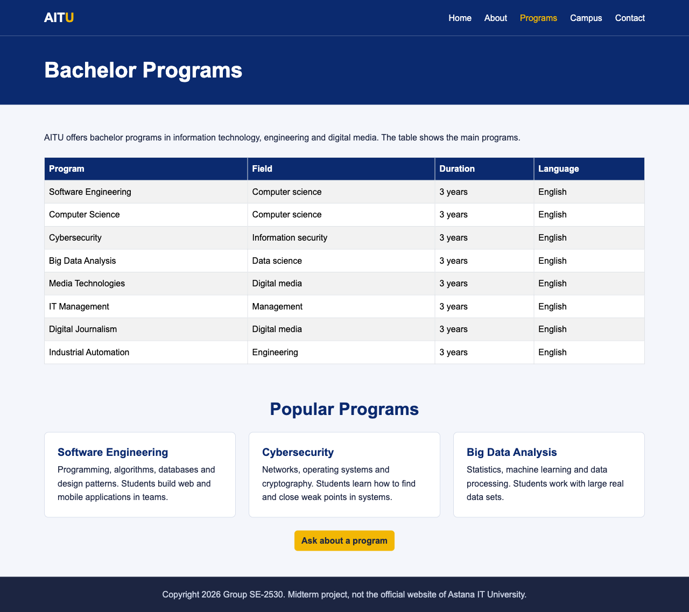
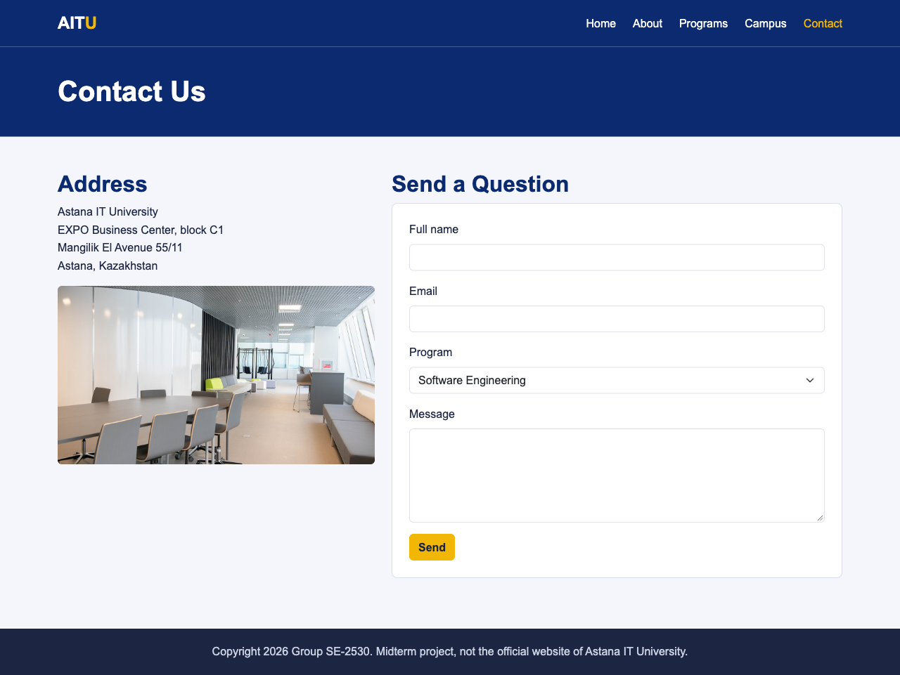
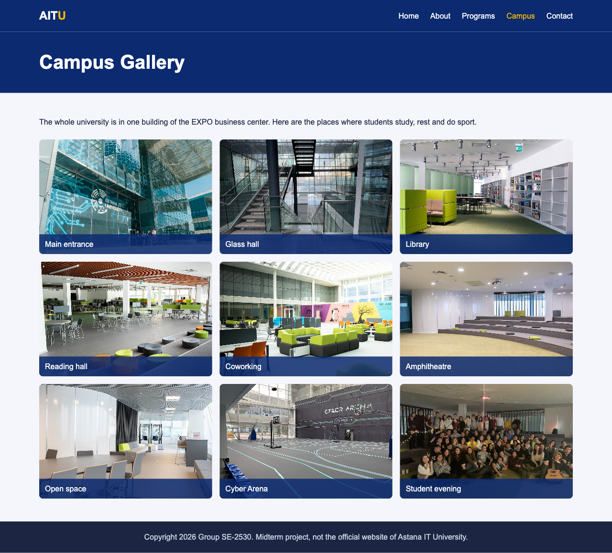
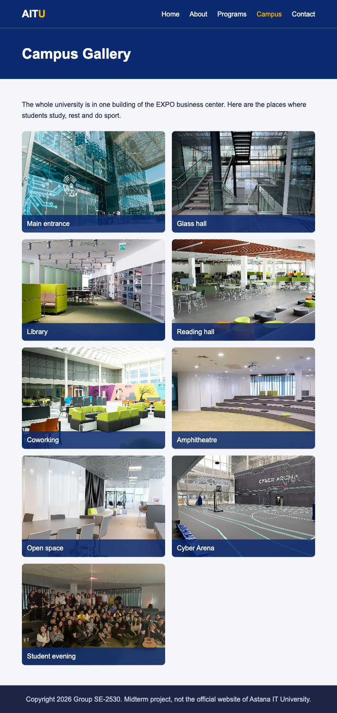
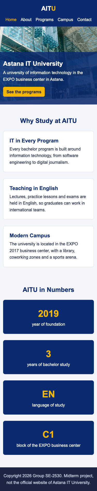

# Midterm Project — Astana IT University Website. Report

Team, group SE-2530: Anarov Daniyal, Mukashev Arman, Nabi Temirlan
Astana IT University, Web Technologies
Repository: https://github.com/torch883/aitu-frontend-midterm
Published site: https://torch883.github.io/aitu-frontend-midterm/

---

## Topic

We chose our own university as the topic. It is a meaningful topic for us, and it gives natural
content for every page the requirements ask for: programs fit into a table, the campus fits into a
gallery, and questions from applicants fit into a form. All photos are real photos of the
university from Wikimedia Commons.

## Team and contributions

We split the work by pages. Each member made three commits in the repository.

| Member | Commits | Part of the project |
|---|---|---|
| Anarov Daniyal | 1–3 | Bootstrap and base styles (header, Flexbox navigation, footer, buttons), home page (photo with the title on top, cards, Grid with numbers), about page |
| Nabi Temirlan | 4–6 | programs page with the table, contact page with the form, README |
| Mukashev Arman | 7–9 | campus gallery (Grid and captions with `position: absolute`), media queries for tablet and mobile, this report and the screenshots |

## Structure

```
index.html  about.html  programs.html  campus.html  contact.html
css/bootstrap.min.css
css/styles.css
images/
```

All five pages use one shared `css/styles.css`. The requirements ask for a consistent theme with
the same colors and fonts on every page, and one stylesheet is the simplest way to guarantee it.
`styles.css` is linked after `bootstrap.min.css`, so our rules override Bootstrap where they overlap
(for example the color of `.btn-primary`).

The theme uses two main colors: dark blue `#0b2a6f` for the header, titles and headings, and yellow
`#f2b705` for buttons, numbers and the active link. The font is Arial on every page.

## Screenshots

| Home | About |
|---|---|
|  |  |

| Programs | Contact |
|---|---|
|  |  |

| Campus (desktop) | Campus (tablet) | Home (mobile) |
|---|---|---|
|  |  |  |

---

## Requirements

### 1. General

| Requirement | Implementation |
|---|---|
| At least 5 pages | `index.html`, `about.html`, `programs.html`, `campus.html`, `contact.html` |
| Navigation bar visible on all pages | the same `<header class="site-header">` with `<nav>` at the top of every page; the current page has `class="active"` |
| Semantic HTML5 elements | `header`, `nav`, `main`, `section`, `article`, `figure`, `figcaption`, `address`, `footer` |

### 2. HTML

| Requirement | Implementation |
|---|---|
| Headings | one `h1` per page, `h2` for sections, `h3` for cards |
| Paragraphs | `p` on every page |
| Lists | the navigation is a `ul`; `about.html` has a `ul` (what students get) and an `ol` (steps to apply) |
| Links | navigation, buttons `See the programs` and `Ask about a program`, a link inside the `ol` |
| Images | building photo on the home page, teachers on the about page, nine photos in the gallery, one on the contact page; every `img` has `alt` |
| Table | `programs.html`: `table` with `thead` and `tbody`, 8 programs, 4 columns |
| Form | `contact.html`: `input type="text"`, `input type="email"`, `select`, `textarea`, `button`, each field with a `label` |
| `div` and `span` | `div` for containers, rows, columns and stats; `span` for the yellow `U` in the logo and the number and text inside each stat |

### 3. CSS

| Requirement | Implementation |
|---|---|
| Selectors | element (`body`, `h1, h2, h3`, `a`), class (`.site-header`, `.gallery`), id (`#mission`, `#contact-form`), descendant (`.logo span`, `.hero img`), pseudo-class (`.nav-links a:hover`) |
| Colors, fonts, spacing, alignment | two theme colors, `font-family: Arial`, `padding` and `gap` of 24px in cards and grids, `text-align: center` in stats |
| Classes and IDs | classes for repeated blocks (`.info-card`, `.stat`, `.gallery-item`); IDs for blocks that exist once (`#mission`, `#contact-form`) |
| Flexbox | `.header-inner { display: flex; justify-content: space-between; align-items: center; }` places the logo on the left and the menu on the right; `.nav-links { display: flex; gap: 24px; }` puts the links in a row |
| Grid | `.stats { display: grid; grid-template-columns: repeat(4, 1fr); }` on the home page; `.gallery { display: grid; grid-template-columns: repeat(3, 1fr); }` on the campus page |
| Positioning | `.hero { position: relative; }` and `.hero-text { position: absolute; bottom: 0; }` put the title on top of the photo; the same pair `.gallery-item` / `.caption` puts captions on the gallery photos |

### 4. Responsive Design

| Requirement | Implementation |
|---|---|
| Media query for tablet | `@media (max-width: 992px)`: lower hero, smaller title, stats in 2 columns, gallery in 2 columns |
| Media query for mobile | `@media (max-width: 576px)`: header in a column (`flex-direction: column`), links wrap, stats and gallery in 1 column |
| Bootstrap grid | `container`, `row`, `col-md-6 col-lg-4` (home cards), `col-lg-7` + `col-lg-5` (about), `col-md-4` (program cards), `col-lg-5` + `col-lg-7` (contact) |
| Bootstrap utilities | spacing `py-5`, `pb-5`, `mb-3`, `mb-4`, `mt-5`; alignment `text-center`; buttons `btn btn-primary`; `img-fluid`, `rounded`; `table table-striped table-bordered`, `table-responsive`; `form-label`, `form-control`, `form-select` |

The two breakpoints are the same as Bootstrap's `lg` (992px) and `sm` (576px), so our media queries
change the layout at the same widths where the Bootstrap columns change.

### 5. Creativity and Presentation

Every page has the same header, the same dark blue title band and the same footer, so the user
always knows where they are. The active page is yellow in the menu. The home page leads to the
programs with a button, and the programs page leads to the contact form.

---

## What turned out to be non-obvious

- Bootstrap and our own styles have to be linked in the right order. If `styles.css` is linked
  before `bootstrap.min.css`, Bootstrap's blue button color wins over our yellow one, because with
  equal specificity the later rule wins.
- The title on the home photo is `position: absolute`, so it is positioned relative to the nearest
  parent with a position. Without `position: relative` on `.hero` it would go to the bottom of the
  page instead of the bottom of the photo.
- Photos have different sizes, and a portrait photo in the gallery would break equal rows. A fixed
  `height` on `.gallery-item` and `object-fit: cover` on the image make every photo fill its cell
  without being stretched.
- The Bootstrap grid and our CSS Grid solve different tasks. We used Bootstrap columns where the
  number of columns changes with Bootstrap breakpoints anyway (cards, two-column pages), and CSS Grid
  for blocks of equal items (numbers and gallery), where we control the number of columns in our own
  media queries.
